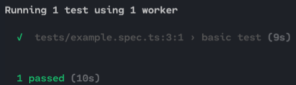
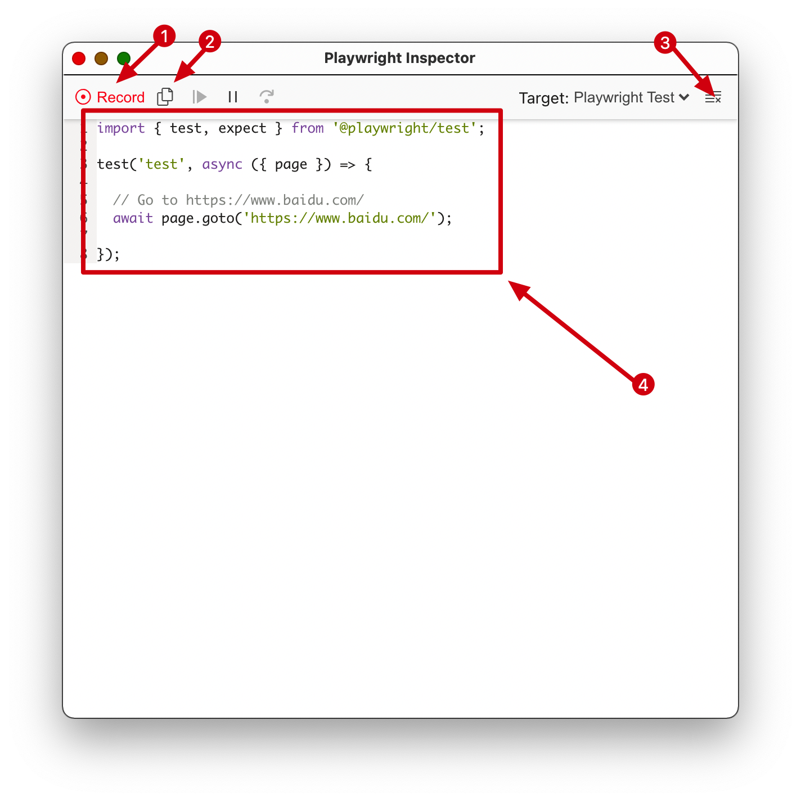
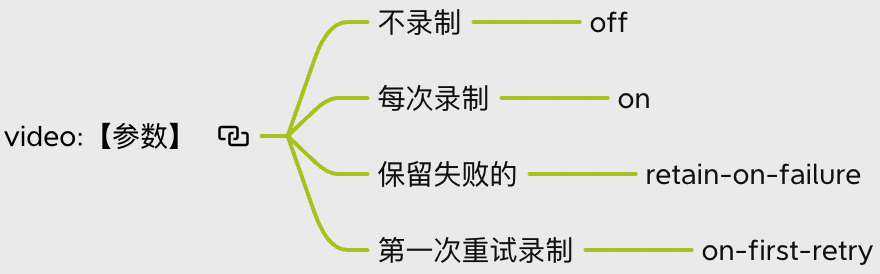
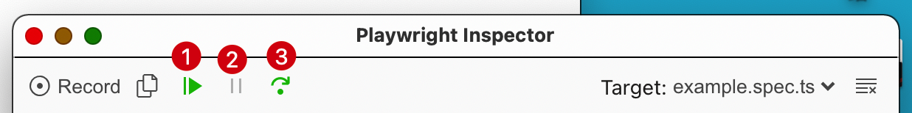

# playwright

## 安装

首先选择一个空文件夹作为`playwright`项目文件夹

然后执行下面命令：

`npm i -D @playwright/test`

+ 安装浏览器支持(比较慢，会等很长时间，放心没有卡住)

`npx playwright install`

## 第一个测试脚本

在安装 `playwright` 的文件夹中运行：

```bash
mkdir tests
cd tests
touch example.spec.ts
```

然后进入 tests文件夹 找到 example.spec.ts 文件 粘贴下面代码并保存

 ```typescript
 /* example.spec.ts */
 import { test, expect } from '@playwright/test';
 
 test('basic test', async ({ page }) => {
   await page.goto('https://playwright.dev/');
   const title = page.locator('.navbar__inner .navbar__title');
   await expect(title).toHaveText('Playwright');
 });
 ```

## 运行

在安装`playwright`的根目录下运行 `npx playwright test` 命令，出现下图结果代表成功：




## Playwright Inspector

> `Playwright Inspector` 是一个图形化的工具，帮助创作和调试 `Playwright 脚本`

### 启动 

`npx playwright codegen 【想测试的网站的url】`



1. 按钮(红色->录制)，在弹出的页面中进行任何操作都会在 ④ 生成相应代码
2. 复制生成的代码
3. 清空代码 ( `await page.goto` 代码不会删除 )
4. 生成的代码

在tests文件夹中新建以`.spec.ts`结尾的文件，复制粘贴保存生成的代码，执行运行命令，`playwright`就会识别

## 配置

在项目的根目录下新建`playwright.config.ts`文件，这个文件会被`playwright`识别为配置文件

在配置文件中粘贴保存下面代码（后续步骤会用到）：

```typescript
import { PlaywrightTestConfig } from "@playwright/test";
const config: PlaywrightTestConfig = {
  retries: 3,
  timeout: 5 * 60 * 1000,
  use: {
    locale: "zh-CN",
    actionTimeout: 10 * 1000,
    navigationTimeout: 30 * 1000,
    trace: "on",
    screenshot: "on",
    video: "on",
  },
};
export default config;
```

`locale`：指定用户区域设置，用于国际化的项目测试

+ 自定义配置文件路径

`npx playwright test --config 【配置文件路径】`

## 重试

> Playwright Test 支持**测试重试**。启用后，失败的测试将被重试多次，直到它们通过，或者直到达到最大重试次数。默认情况下，不重试失败的测试。

通过`retries`来配置重试的次数

### 测试分类

- `passed` - 第一次运行通过的测试；
- `flaky` - 第一次运行失败但重试时通过的测试；
- `failed` - 第一次运行失败并且所有重试失败的测试。

```bash
Running 3 tests using 1 worker

  ✓ example.spec.ts:4:2 › first passes (438ms)
  x example.spec.ts:5:2 › second flaky (691ms)
  ✓ example.spec.ts:5:2 › second flaky (522ms)
  ✓ example.spec.ts:6:2 › third passes (932ms)

  1 flaky
    example.spec.ts:5:2 › second flaky
  2 passed (4s)
```

## Playwright Trace Viewer

> Playwright Trace Viewer 是一个图形化工具，可帮助在脚本运行后探索记录的 Playwright 轨迹

按照上面配置运行一次测试后会发现文件夹中多了一个 test-results文件夹 文件夹中有一个 `trace.zip` 文件，在根目录下运行

 ```bash
 npx playwright show-trace test-results/tests-example-basic-test/trace.zip
 ```

弹出下面窗口：


左侧可以看到每个动作，选择动作后可以看到动作的详细信息

上方看一看到运行过程中的截图

### 配置

通过修改配置项的 `trace` 来决定要记录那些：

+ 不记录 `off`
+ 都记录 `on`
+ 第一次重试记录 `on-first-retry`
+ 只记录失败的 `retain-on-failure`

## 截图

配置文件中 ` screenshot: "on"`开启截图，截图只会截取测试完成后的图像。

测试失败（`test-finished-1.png`）和测试成功（`test-failed-1.png`）生成的图片名字是不同的，如果只需要查看失败的测试的截图配置`screenshot: "only-on-failure"`

## 录屏

配置文件中 ` video: "on"`开启录屏。

test-results 文件夹下有一个 `.webm` 后缀结尾的文件，这个就是 `playwright` 帮我们录制的操作过程的视频

+ 配置



每次运行`npx playwright test`都会清空 test-results文件夹

## 超时

配置文件中`timeout: 5 * 60 * 1000`配置超时时间，单位：毫秒。

配置文件中的`timeout`设置全局的动作超时，实际应用中为了资源浪费，可能需要单独对某些类型或者单个动作的动作设置超时

### 某些类型的操作超时

+ 动作超时时间

配置项：`actionTimeout`

执行`page.click`、`page.dblclick`... ... 页面操作的超时时间

+ 导航超时时间

配置项：`navigationTimeout`

执行`page.goto`、`page.waitForNavigation`... ... 跳转url的命令的超时时间

超时控制台输出：

```bash
page.goto: net::ERR_CONNECTION_CLOSED at https://www.google.com/
=========================== logs ===========================
navigating to "https://www.google.com/", waiting until "load"
============================================================
```

### 单个动作设置超时

```typescript
import { test, expect } from '@playwright/test';

test('basic test', async ({ page }) => {
  await page.goto('https://playwright.dev', { timeout: 30000 });
  await page.locator('text=Get Started').click({ timeout: 10000 });
});
```

## 调试

调试需要 `Playwright Inspector` 



1. 执行到 `await page.pause()` 命令
2. 暂停
3. 一条一条的执行

### 开启调试

+ `PWDEBUG=1 npx playwright test`

会在第一句执行前暂停

+ `PWDEBUG=console npx playwright test`

代码中添加`await page.pause()`，调试执行到这行命令会暂停，不会影响`npx playwright test`命令

## 常用API

> 详细的 API 请访问 https://playwright.dev/docs/api/class-test#test-call

### test(title,testFunction)

声明一个测试。

+ title: 描述这个测试是做什么的
+ testFunction: 接受一个或两个参数的测试函数

```typescript
test('【这个测试是测什么的】', async ({ page }) => {
  // page:此测试运行的独立页面对象,很多接口都要通过 page. 来调用 
  // 测试 
});
```

### page.goto(URL)

页面导航到的 URL

### page.locator(选择器)

定位器。

和元素选择器类似，定位器可以一次选择多个元素并且对多个元素执行操作。

与元素选择器不同之处：

+ 定位器每次调用都会重新根据条件选择元素。

```typescript
// 选择文字是提交的元素
const handle = await page.$('text="提交"');
// ...
await handle.click();
// 如果上一次点击导致文字发生变化，下面的这次点击还是在这个元素上
await handle.click();
```

```typescript
// 选择文字是提交的元素
const locator = page.locator('text="提交"');
// ...
await locator.click();
// 如果上一次点击导致文字发生变化，下面的这次点击一定不是上次选择的元素
await locator.click();
```

### page.click(选择器)

单击选中的元素，如果选择的元素有多个，点击第一个，如果没有选择的元素，就会一直等待，直到超时时间

## 选择器

> 详细的 API 请访问 https://playwright.dev/docs/selectors

### 文本选择器

```typescript
// 不区分大小写 包含字符串的元素
await page.click('text=Log in');
// 带引号 完全匹配
await page.click('text="Log in"');
// 使用正则表达式
await page.click('text=/Log\\s*in/i');

// 错误使用方式，会匹配很多文本有"Log in"的元素包括<body>元素
await page.click(':has-text("Log in")');
// 正确使用方式, 只会匹配文本有"Log in"的<article>元素
await page.click('article:has-text("Log in")');

// #nav-bar元素内部 包含”Log in“的最小元素
await page.click('#nav-bar :text("Log in")');
```

| 选择器                          | 说明                                                         |
| ------------------------------- | ------------------------------------------------------------ |
| text=【文本】                   | 不区分大小写<br />匹配包含文本的元素                         |
| text="【文本】"                 | 文本节点完全匹配                                             |
| text=/【正则表达式】/           | 根据正则表达式匹配                                           |
| :has-text("【文本】")           | 可以在css选择器中使用<br />匹配内部某处包含指定文本的任何元素 |
| :text(“【文本】”)               | 可以在css选择器中使用 <br />匹配包含指定文本的最小元素 <br />类似text=【文本】 |
| :text-is(“【文本】”)            | 可以在css选择器中使用<br />类似text="【文本】"               |
| :text-matches(”【正则表达式】“) | 可以在css选择器中使用<br />类似text=/【正则表达式】/         |

### CSS 选择器

可以使用标准的css选择器 https://developer.mozilla.org/zh-CN/docs/Learn/CSS/Building_blocks/Selectors 

`playwright`其他常用的自定义伪类:

+ :visible

选择可见元素

+ :has

包含其他元素的元素

### 第N个元素选择

您可以使用`nth=`选择器将查询范围缩小到第 n 个匹配项。

索引从 0 开始。

```typescript
// 选择第一个按钮
await page.click('button >> nth=0');

// 选择最后一个按钮
await page.click('button >> nth=-1');
```

### 从查询结果中选择第几个匹配的

`:nth-match`

索引从 1 开始。

```typescript
// 选择第三个文字是"Buy"的按钮
await page.click(':nth-match(:text("Buy"), 3)');
```

### 最佳实践

#### 优先面向用户的属性

文本内容、占位符、标签等很少改动的属性

#### 显示定义ID

当面向用户的属性频繁更改时，使用显式测试 ID

```tsx | pure
<button data-test-id="directions">Itinéraire</button>
```

```typescript
// queries data-test-id attribute with css
await page.click('css=[data-test-id=directions]');
await page.click('[data-test-id=directions]'); // short-form

// queries data-test-id with id
await page.click('data-test-id=directions');
```

#### 避免过长的css选择器

防止当 DOM 结构发生变化时，这些选择器无效

## 断言

> expect 文档地址: https://jestjs.io/docs/expect

> expect 额外的匹配器：https://github.com/jest-community/jest-extended

`playwright`使用 `expect` 检查值是否满足某些条件

`expect` 的 api 特别容易让人记住

```js
expect(【值】).toBe(12);

expect(【值】).toBeFalsy();
expect(【值】).toBeTruthy();
expect(【值】).toBeNull();
expect(【值】).toBeUndefined();

expect(【值】).not.toBeFalsy();
expect(【值】).not.toBeTruthy();
expect(【值】).not.toBeNull();
expect(【值】).not.toBeUndefined();
```

`expect().toBe()`使用`Object.is()`来比较两个值，不用担心`NaN===NaN`返回`false`的情况。

`expect(【值】).toBeFalsy()` 预期值是假值，假值的情况`false`，`0`，`''`，`null`，`undefined`，`NaN`

`.not`用于测试值不是预期的情况

### 数组&对象

`.toContain(item)`

要检查的项目是在数组中，使用`===`比较


`.toEqual(value)`

递归比较对象实例的所有属性，每一项的值使用`Object.is()`比较


`expect.arrayContaining(array)`

+ 比较一个数组是否包含某个数组

```typescript
expect(['Alice', 'Bob', 'Eve']).toEqual(expect.arrayContaining(expected));
```


`.toHaveLength(number)`

比较数组或者字符串大小

### 注意

浮点数存在精度问题，所以使用 `.toBeCloseTo(number, numDigits?)`

`numDigits` 精确到第几位小数

```typescript
// ❎
expect(0.2 + 0.1).toBe(0.3); 
// ✅
expect(0.2 + 0.1).toBeCloseTo(0.3, 5);

// ❎
expect(0.36).toBeCloseTo(0.3, 1);
// ✅
expect(0.35).toBeCloseTo(0.3, 1);
```

## 不同状态下的测试

```typescript
test('测试描述，测试标签：@fast @userPage', async ({ page }) => {
  // test.fail()
  // test.fixme()
  // test.slow()
  // test.skip()
});
test.only('focus this test', async ({ page }) => {
  // Run only focused tests in the entire project.
});
```

### 失败测试

`test.fail(【条件】?,【描述】?)`

+ 将测试标记为失败
+ 没有失败会提示

```bash
1) tests/example.spec.ts:3:1 › test ==============================================================

Expected to fail, but passed.
```

+ 会运行测试

### 应该修复的测试

`test.fixme(【条件】?,【描述】?)`

+ 不会运行测试

```typescript
  -  tests/example.spec.ts:3:1 › test


  1 skipped
```

### 缓慢测试

`test.slow()`

+ 超时是设置的3倍

### 重点测试

`test.only()`

+ 如果有`test.only()`的测试只会运行`test.only()`的测试

### 跳过测试

+ 不会运行测试

`test.skip(条件?，描述?)`

### 运行指定标签的测试

`npx playwright test --grep 【标签】`

+ 测试的描述里面包含标签相同的文字就会运行

```typescript
const { test, expect } = require('@playwright/test');

// 为了方便区分 可以使用 @+标签 的形式
test('Test login page @fast', async ({ page }) => {
  // ...
});

test('Test full report @slow', async ({ page }) => {
  // ...
});
```

```bash
npx playwright test --grep @fast
```

### 测试分组

`test.describe`

```typescript
test.describe('two tests', () => {
  test('one', async ({ page }) => {
    // ...
  });

  test('two', async ({ page }) => {
    // ...
  });
});
```

## 钩子

| API               | 说明               |
| ----------------- | ------------------ |
| test.afterAll()   | 所有测试结束后执行 |
| test.afterEach()  | 每个测试结束后执行 |
| test.beforeAll()  | 所有测试开始前执行 |
| test.beforeEach() | 每个测试开始前执行 |

```typescript
test.beforeAll(async () => {
  console.log('Before tests');
});

test.afterAll(async () => {
  console.log('After tests');
});
```

## 验证

### 使用 beforeEach 登录

`test.beforeEach` 每个测试运行前会执行一遍，效率低。

```typescript
// 登录 github
test.beforeEach(async ({ page }) => {
  // Runs before each test and signs in each page.
  await page.goto('https://github.com/login');
  await page.click('text=Login');
  await page.fill('input[name="login"]', 'username');
  await page.fill('input[name="password"]', 'password');
  await page.click('text=Submit');
});
```

### 设置 cookie 登录

1. 运行 `playwright codegen 【抓取cookie的网址】 --save-storage "cookie"`命令，然后在网址中执行相关操作（登录……）。
2. 关闭浏览器，项目文件夹中就会多出一个`cookie`文件。

3. 使用 `test.use()`为测试文件设置

```typescript
test.use({
  storageState: "cookie" 
})
test('', async ({ page }) => {
 // 这个测试在运行时就会带上 storageState 的内容
});
```

如果在一个域名下面抓取的cookie要用到另一个域名上，需要修改cookie文件的`domain`属性。
